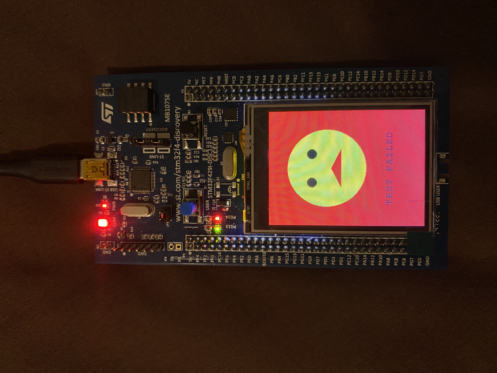

# Gesture Recognition

A challenge tackling concerns of embedded sentry using the STM32F429I-DISC1. A system providing generic locking/unlocking capabilities using an Inertial Measurement Unit (IMU) for gesture recognition.

## I3G4250D MEMS Gyroscope

A 3-axis gyroscope was used to record the roll, pitch, and yaw as angular velocity in degrees per second. The SPI communication protocol was used to write configuration registers and read output data registers.

## Algorithm

Dynamic Time Warping (DTW) is implemented to measure the similarity between pairs of two temporal sequences for all three axes.

Three distance matrices are constructed, and the optimal alignment is determined by performing backtracking. It is implemented in `main.cpp` as the `DTW` and `back_track` functions. A threshold value is returned by the `back_track` function, which averages the best alignment sequence.

## Finite State Machine

A five-stage Finite State Machine (FSM) is used to model the dynamic behavior and transition between states depending on the user input captured through a physical button on the discovery kit.

1. **IDLE_STATE**  
   Default state after a reset; it clears the LCD, turns off LEDs, and waits for the user to press the button. 
   

3. **RECORDKEY_STATE**  
   Samples the output data from the gyroscope at a sampling rate of 25 Hz (or 40 ms) using a timer and stores it as a passkey in the buffer. The progress is indicated by a progress bar displayed on the LCD, and successful completion is indicated by turning on the green LED. 
   

4. **ENTERKEY_STATE**  
   Similar functionality as `RECORDKEY_STATE`; however, the entry buffer is filled with the gesture attempted. The red LED is turned on for successful completion and prompts the user to transition states by pressing the button. 
   

6. **PROCESS_STATE**  
   The raw data from the sensor is converted to degrees per second according to sensitivity. The `DTW` and `back_track` functions are called to calculate threshold values. After comparing values for all three axes, test pass (unlock) or test fail (locked) messages are displayed on the LCD. 
   
   

8. **RETRY_STATE**  
   If the gestures don't match, it allows the user to reattempt unlocking the device. 
   
